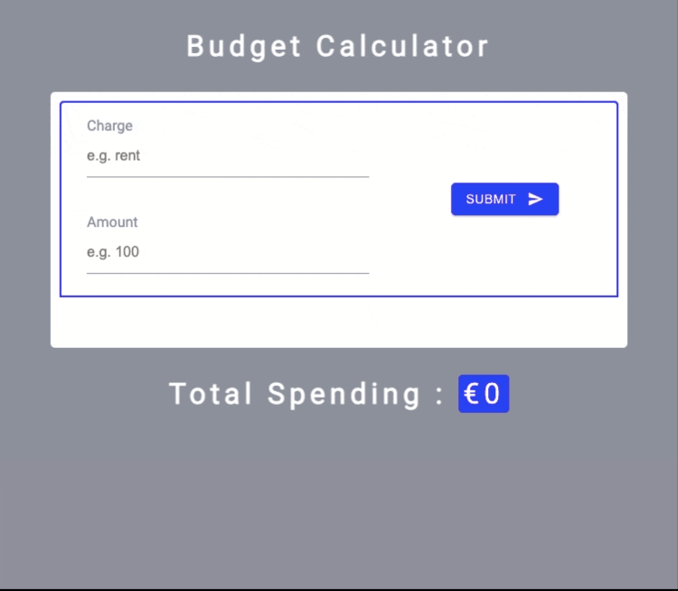

# BUDGET CALCULATOR APP - REACT

> A simple responsive react app to save your daily expenses and know how much you spend totally,

### ✨ [Demo](https://budget-calculator-reactapp.netlify.app/)

**Features :**

- Add charges name with the amount beside it.
- it automatically calculate the total amount you spent.
- You can add each item of the list or delete if you want.
- You can clear all the data with one click.
- You get an alert message for each event you do in the app.

## CodeAlong with 

[
Coding Addict](https://www.youtube.com/watch?v=f6HYLHrYpGs)

## 🤝 Contributing

Contributions, issues and feature requests are welcome! Feel free to check [issues page](https://github.com/MoSaif00/Budget-Calculator-React/issues).
